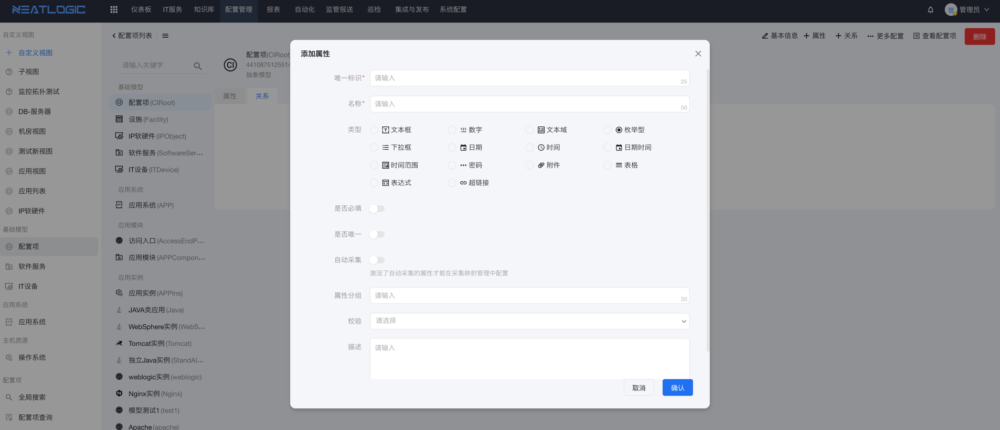
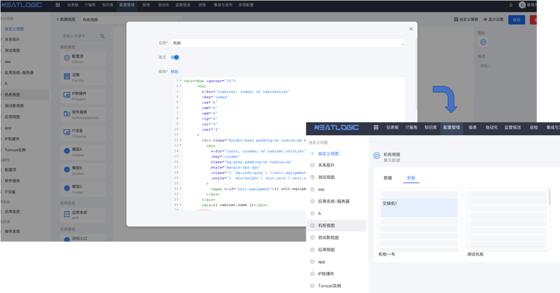
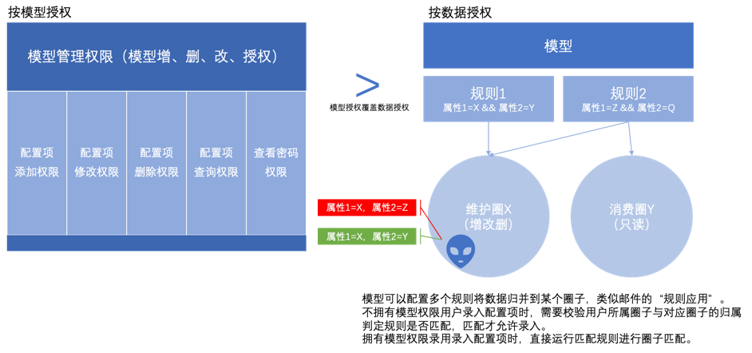

[中文](README.md) / English

    

---

## About

neatlogic-cmdb is a configuration management module, which can achieve automatic discovery and collection when paired
with [neatlogic-autoexec](../../../neatlogic-autoexec/blob/develop3.0.0/README.md). It supports the modification of
configuration items in the process when paired
with [neatlogic-itsm](../../../neatlogic-itsm/blob/develop3.0.0/README.md), and it supports automatic data push to the
People's Bank of China when used with [neatlogic-pbc](../../../neatlogic-pbc/blob/develop3.0.0/README.md).
neatlogic-cmdb adopts the design concept of "Everything is CI", and supports the direct transformation of external data
into configuration items for cmdb internal consumption, such as user information, organizational structure information,
etc.
neatlogic-cmdb cannot be deployed or built independently. If you need to build and deploy, please refer to the
instructions in the [neatlogic-itom-all](../../../neatlogic-itom-all/blob/develop3.0.0/README.md) documentation.

## Features

### Custom Model

Supports custom models and model inheritance.

- Support multiple attribute types such as reference attribute, password, attachment, text, number, date time,
  expression, etc.
  
- Relationships support bidirectional rules
  

### Custom Views

Custom views allow users to have the ability to reorganize data. Users can reorganize the relationship between models
through configuration, or skip intermediate models and go directly to the target model to meet different data
consumption scenarios.

- Visual data view configuration.
  
- A small amount of code development for the data view can achieve more personalized display effects.
  
- Visual topology view configuration.
  

### Configuration item transaction

Imitate the database to introduce transaction design, configuration item modification supports two-stage submission,
support modification and effective decentralization processing, support transaction recovery, comparison and other
functions

- Global transaction management to facilitate discovery of recently modified configuration items.
  
- Complete display of configuration item modification records.
  

### Topology

Support layered, star and other automatic layout methods.

- Model topology
  
- configuration item topology
  
- Custom view topology (similar to configuration item topology, but the relationship is generated according to the
  custom view)

### Authorization

In addition to the traditional authorization by model, it also supports the authorization of individual configuration
items through rules.

- Model permission settings
  
- Licensing by group
  

### Global search

- Quickly query configuration items through full-text indexing.
  

## All Features

<table><tr><td>Number</td><td>Category</td><td>Feature</td><td>Description</td></tr><tr><td>1</td><td rowspan="11">Model Management</td><td>Support dynamic definition of model configurations</td><td>Model configurations can be dynamically defined, including settings for attributes, relationships, display names, unique rules, validation rules, and attribute and relationship grouping.</td></tr><tr><td>2</td><td>Support optional field types for models</td><td>Model properties can be configured, including attribute types, validation, and automatic collection settings. Common attribute field types include text boxes, numbers, text areas, dropdowns, dates, times, time ranges, passwords, attachments, tables, expressions, and links.</td></tr><tr><td>3</td><td>Support model inheritance relationships</td><td>Support defining abstract models and model inheritance, simplifying the maintenance of model attributes and relationships.</td></tr><tr><td>4</td><td>Support definition of model relationship types</td><td>Support defining model relationship types, including display rules for relationships and grouping of model relationships.</td></tr><tr><td>5</td><td>Support model relationship definitions</td><td>Model relationships support upstream and downstream references, self-referencing, and association of multiple targets. Two types of association are supported: single select and multi-select. Unique validation is supported, including uniqueness within the model and globally.</td></tr><tr><td>6</td><td>Support different validation rules for model properties</td><td>Model properties can have different validation rules, including regular expressions, third-party system invocations, or custom complex rule validations.</td></tr><tr><td>7</td><td>Support unique judgment of multiple combined properties</td><td>Support unique judgment of multiple combined properties, for example, unique combination of IP and port while allowing the same IP and port separately.</td></tr><tr><td>8</td><td>Support comprehensive auditing functionality</td><td>Comprehensive auditing functionality that records detailed changes to attributes and relationships.</td></tr><tr><td>9</td><td>Authorization management</td><td>Grant management or viewing permissions to different roles through authorization.</td></tr><tr><td>10</td><td>Support definition of data compliance rules for model configuration items</td><td>Support setting data compliance checks for data within the model according to management requirements.</td></tr><tr><td>11</td><td>Support setting automatic collection frequency for models</td><td>Support setting the automatic collection frequency and data range for models.</td></tr><tr><td>12</td><td rowspan="9">Configuration Item Management</td><td>Support data transactions</td><td>Support transactional operations on configuration items within the model, with preview and approval of data with only transaction submission permissions. Transaction types include: add, modify, and delete.</td></tr><tr><td>13</td><td>Support data storage methods</td><td>Support configuration item operations through the configuration page, batch import using Excel templates, automatic discovery, and interface operations.</td></tr><tr><td>14</td><td>Support topology display of data</td><td>Support topological display and display rule settings for configuration item data based on defined relationships.</td></tr><tr><td>15</td><td>Support displaying configuration item relationships in detail view</td><td>Support displaying configuration item relationships in tabular or list format.</td></tr><tr><td>16</td><td>Support data-level authorization</td><td>Support data-level authorization based on configuration item attribute values.</td></tr><tr><td>17</td><td>Compliance check</td><td>Custom rule-based compliance checks.</td></tr><tr><td>18</td><td>Global search</td><td>Full-text search based on keyword tokenization.</td></tr><tr><td>19</td><td>Support configuration relationship data aging</td><td>For automatically collected relationship data, the option to set a time period for data aging and cleanup.</td></tr><tr><td>20</td><td>Group management</td><td>Customize read-only and maintenance permissions for configuration model data, support defining conditional rules for corresponding model configuration item data.</td></tr><tr><td>21</td><td rowspan="6">Configuration Views</td><td>Support custom query views that display properties and relationships across models</td><td>Support custom query views that display properties and relationships across models based on their associations.</td></tr><tr><td>22</td><td>Support user-configurable and searchable view properties</td><td>View properties can be configured by users, and all properties support sorting and searching as filter conditions.</td></tr><tr><td>23</td><td>Support multi-level grouping and total calculation based on properties</td><td>Support multi-level grouping based on properties and automatic calculation of the total number of configuration items queried in a view.</td></tr><tr><td>24</td><td>Support exporting view query results</td><td>View query results can be exported.</td></tr><tr><td>25</td><td>Support authorization control for managing and accessing views</td><td>Support management and access of views through authorization control.</td></tr><tr><td>26</td><td>Support structured display of view data</td><td>Logic grouping and hierarchical display of view data.</td></tr><tr><td>27</td><td rowspan="4">Resource Center</td><td>Application Resource Center</td><td>Application-centric display and consumption of application resources, including modules, middleware, databases, and operating system information.</td></tr><tr><td>28</td><td>Asset Resource Center</td><td>Resource center based on resources/functional positions, including application, application instances, hardware, etc.</td></tr><tr><td>29</td><td>Account settings</td><td>Support binding public and private accounts to assets.</td></tr><tr><td>30</td><td>Tag management</td><td>Support tagging assets with different labels and querying based on labels and types.</td></tr><tr><td>31</td><td rowspan="3">Auto Discovery</td><td>Network segment scanning</td><td>Support network segment scanning based on IP ranges, ports, and asset characteristics.</td></tr><tr><td>32</td><td>Asset characteristics</td><td>Support adding and importing asset characteristics.</td></tr><tr><td>33</td><td>Unknown devices</td><td>Support marking features of unknown devices online and automatically importing them into the feature library.</td></tr><tr><td>34</td><td rowspan="8">Data Collection</td><td>Operating system collection</td><td>Includes major versions of Windows Server, Linux distributions, and AIX, supporting data discovery with and without agents.</td></tr><tr><td>35</td><td>Middleware collection</td><td>Collection and discovery of popular versions of Tomcat, Nginx, WebSphere, WebLogic, Redis, Resin, Java processes, WebSphere MQ, ActiveMQ, RabbitMQ, Apache, IIS, JBoss, KeepAlive, Lighttpd, Python processes, Tuxedo, ZooKeeper, and Memcached.</td></tr><tr><td>36</td><td>Database collection</td><td>Includes major versions of MySql, Oracle, DB2, MSSQLServer, MongoDB, Elasticsearch, Hadoop, Sybase, PostgreSQL, and Informix.</td></tr><tr><td>37</td><td>Network device collection</td><td>Includes popular load balancing devices such as F5 and A10, as well as switches, routers, and firewalls from various vendors.</td></tr><tr><td>38</td><td>Virtualization collection</td><td>Supports vSphere 6.0+, SMTX, and Huawei FusionCompute data collection and relationship calculation.</td></tr><tr><td>39</td><td>Server hardware collection</td><td>Supplementing and calculating data for manually imported hardware devices.</td></tr><tr><td>40</td><td>Fiber optic data collection</td><td>Data supplementation and relationship calculation for mainstream fiber optic versions.</td></tr><tr><td>41</td><td>Storage device collection</td><td>Specific to customer site environments, including IBM DS series, IBM Flash series, IBM V7000 series, IBM SVC, IBM FlashSystem 900, EMC RPA, EMC VNX, NetApp, HDS VSP series, HDS AMS series.</td></tr><tr><td>42</td><td rowspan="2">Data Consumption</td><td>RESTful API</td><td>Supports RESTful API management for all CMDB operations, including custom authentication methods, access frequency, and time restrictions. Common operations include model management, configuration item management, and view queries.</td></tr><tr><td>43</td><td>Message subscription</td><td>CMDB configuration item operations push data to message queues, including add, modify, and delete operations.</td></tr></table>