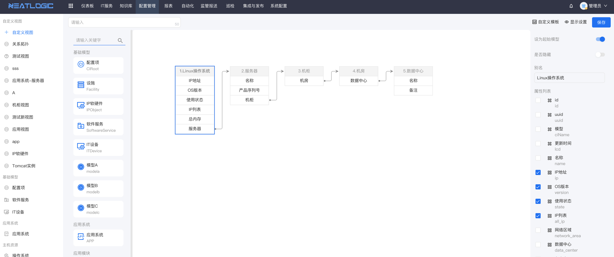
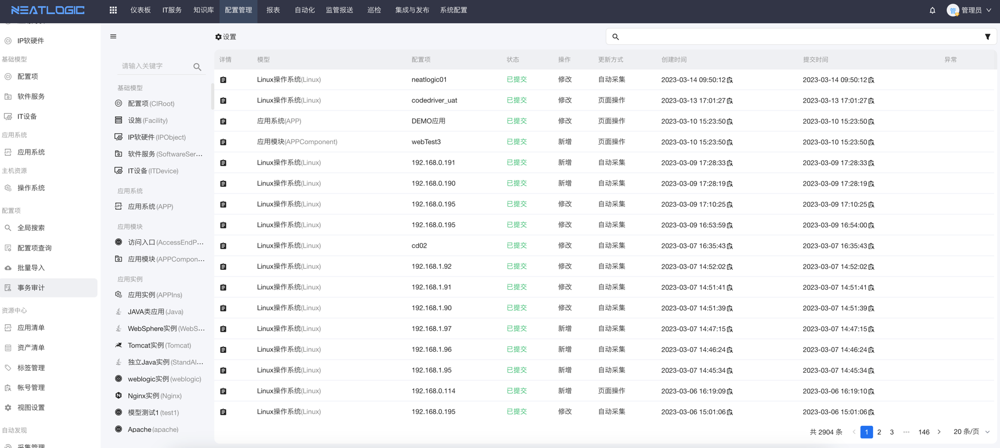
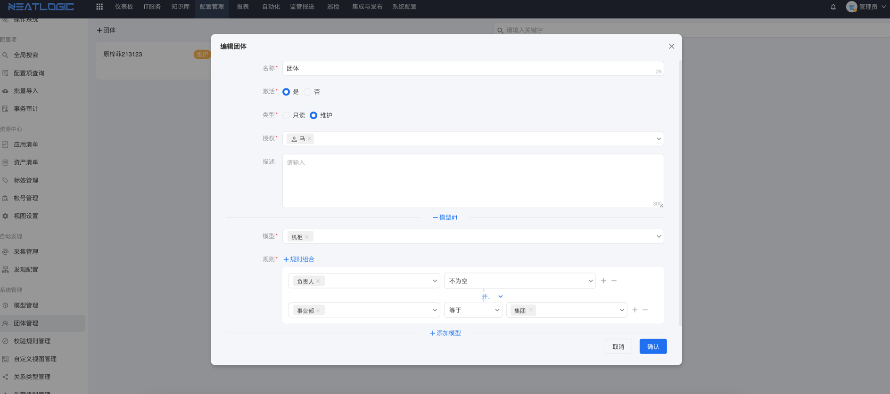

[中文](README.md) / English

## about

neatlogic-cmdb is a configuration management module, with neatlogic-autoexec can realize automatic discovery and
collection, with neatlogic-itsm to support modification of configuration items in the process, with naetlogic-pbc to
support automatic push of data to the People's Bank of China.
neatlogic-cmdb adopts the design concept of "everything is CI", and supports the direct conversion of external data into
configuration items for internal consumption of cmdb, such as user information, organizational structure information,
etc.

## The main function

### Custom Model

neatlogic-cmdb implements a custom model by automatically generating tables, supports inheritance between models, and
takes into account the retrieval performance of a single configuration item and the performance of batch reporting.

- Support multiple attribute types such as reference attribute, password, attachment, text, number, date time,
  expression, etc.
  
- Relationships support bidirectional rules
  

### Custom Views

Custom views allow users to have the ability to reorganize data. Users can reorganize the relationship between models
through configuration, or skip intermediate models and go directly to the target model to meet different data
consumption scenarios.

- Visual data view configuration.
  
- A small amount of code development for the data view can achieve more personalized display effects.
  
- Visual topology view configuration.
  

### Configuration item transaction

Imitate the database to introduce transaction design, configuration item modification supports two-stage submission,
support modification and effective decentralization processing, support transaction recovery, comparison and other
functions

- Global transaction management to facilitate discovery of recently modified configuration items.
  
- Complete display of configuration item modification records.
  

### Topology

Support layered, star and other automatic layout methods.

- Model topology
  
- configuration item topology
  
- Custom view topology (similar to configuration item topology, but the relationship is generated according to the
  custom view)

### Permissions

In addition to the traditional authorization by model, it also supports the authorization of individual configuration
items through rules.

- Model permission settings
  
- Licensing by group
  

### Other functions

- Compliance check
- global search
- Resource Center (Linkage with Automation)