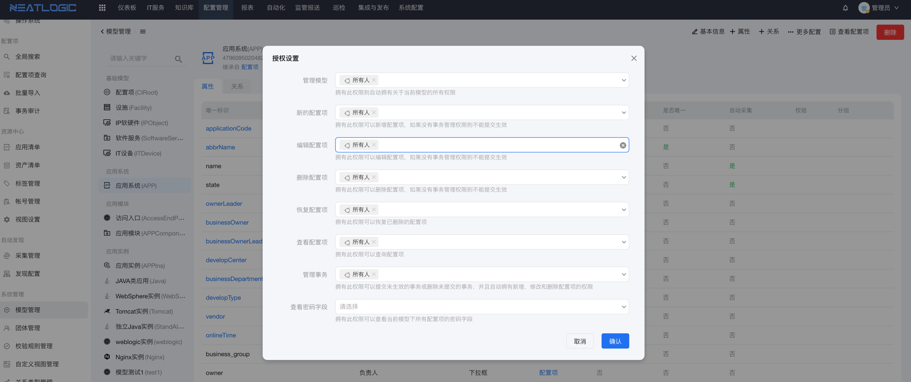
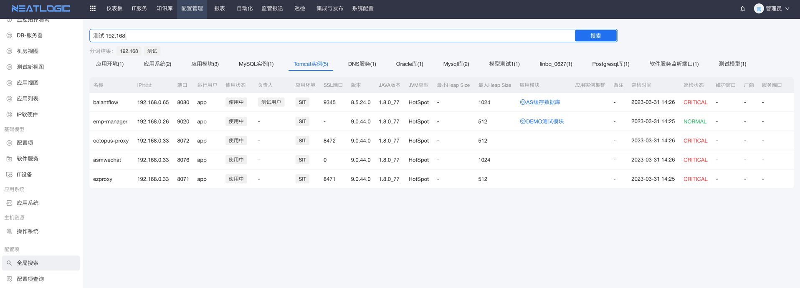

中文 / [English](README.en.md)

    

---
## 关于

neatlogic-cmdb是配置管理模块，配合[neatlogic-autoexec](../../../neatlogic-autoexec/blob/develop3.0.0/README.md)
可以实现自动发现和采集，配合[neatlogic-itsm](../../../neatlogic-itsm/blob/develop3.0.0/README.md)
支持在流程中修改配置项，配合[neatlogic-pbc](../../../neatlogic-pbc/blob/develop3.0.0/README.md)支持数据自动推送到人民银行。
neatlogic-cmdb采用"万物皆CI"的设计理念，支持把外部数据直接转化成配置项，供cmdb内部消费，例如用户信息、组织架构信息等。
neatlogic-cmdb不能单独部署，也不能单独构建，如需构建和部署，请参考[neatlogic-itom-all](../../../neatlogic-itom-all/blob/develop3.0.0/README.md)
的说明文档。

## 主要功能

### 自定义模型

支持自定义模型，支持模型继承。

- 支持引用属性、密码、附件、文本、数字、日期时间、表达式等多种属性类型。
  
- 关系支持双向规则
  

### 自定义视图

自定义视图让用户有重组数据的能力，用户可通过配置重新组织模型之间的关联关系，或者跳过中间模型，直达目标模型，满足不同的数据消费场景。

- 可视化数据视图配置。
  
- 对数据视图进行少量代码开发，可以实现更多个性化展示效果。
  
- 可视化拓扑视图配置。
  

### 配置项事务

模仿数据库引入事务设计，配置项修改支持二段提交，支持修改和生效分权处理，支持事务恢复，比较等功能

- 全局事务管理，方便发现最近修改的配置项。
  
- 配置项修改记录完整展示。
  

### 拓扑

支持分层、星形等多种自动布局方式。

- 模型拓扑
  
- 配置项拓扑
  
- 自定义视图拓扑（和配置项拓扑类似，但关系根据自定义视图生成）

### 权限

除了传统的按模型授权以外，还支持通过规则对单个配置项进行授权。

- 模型权限设置
  
- 按团体授权
  

### 全局搜索

- 通过全文检索快速查询配置项
  

## 功能列表

<table border="1"><tr><td>编号</td><td>分类</td><td>功能点</td><td>说明</td></tr><tr><td>1</td><td rowspan="11">模型管理</td><td>支持动态定义配置模型</td><td>配置模型支持动态定义，支持模型的属性、关系、显示名、唯一规则、校验规则、属性和关系分组等设置。</td></tr><tr><td>2</td><td>支持可选模型的字段类型</td><td>配置模型内属性设置，包括属性类型、校验、是否自动采集配置，常用的属性字段类型，包括：文本框、数字、文本域、下拉框、日期、时间、时间范围、密码、附件、表格、表达式、链接。</td></tr><tr><td>3</td><td>支持模型继承关系</td><td>支持定义抽象模型、模型继承，简化配置模型的属性、关系的维护。</td></tr><tr><td>4</td><td>支持模型关系类型定义</td><td>支持模型关系类型定义，包括关系的展示规则、和模型关系分组。</td></tr><tr><td>5</td><td>支持模型关系定义</td><td>模型关系支持上、下游引用和模型自我引用，一个关系关联多个目标等设置，支持单选和多选两种关联方式，支持唯一性校验，包括模型内部和全局范围的唯一性。</td></tr><tr><td>6</td><td>支持模型属性使用不同的校验规则</td><td>模型属性可以使用不同的校验规则，除了正则表达式，还支持调用第三方系统或通过定制的方式进行复杂的规则校验。</td></tr><tr><td>7</td><td>支持多个属性进行组合唯一判断</td><td>支持多个属性进行组合唯一判断，例如IP和端口的组合唯一，但允许出现相同IP和相同端口。</td></tr><tr><td>8</td><td>支持有完善的审计功能</td><td>有完善的审计功能，能详细记录发生变化的属性和关系。</td></tr><tr><td>9</td><td>授权管理</td><td>通过授权给不同的角色授予管理或查看的权限。</td></tr><tr><td>10</td><td>支持模型配置项数据合规规则定义</td><td>支持根据管理的要求对模型内的数据设置数据合规检查设置。</td></tr><tr><td>11</td><td>支持模型自动采集频率设置</td><td>支持设置模型的自动采集频率、数据范围。</td></tr><tr><td>12</td><td rowspan="9">配置项管理</td><td>支持数据事务</td><td>支持对模型内的配置项的事务操作，对只有提交事务权限的数据进行预览入库审核。事务包括：新增、修改、删除3种操作类型。</td></tr><tr><td>13</td><td>支持数据入库方式</td><td>支持对模型的配置页面操作、下载Execl模板批量导入、自动发现、接口操作方式。</td></tr><tr><td>14</td><td>支持数据拓扑展示</td><td>支持配置项数据根据模型定义的关系进行拓扑展示和展示规则设置。</td></tr><tr><td>15</td><td>支持明细界面配置项关系展示</td><td>支持配置项关系表格或列表方式展示。</td></tr><tr><td>16</td><td>支持数据级授权</td><td>支持数据级授权，根据配置项属性值配置授权规则。</td></tr><tr><td>17</td><td>合规检查</td><td>自定义规则的合规检查。</td></tr><tr><td>18</td><td>全局检索</td><td>根据关键字分词全文检索。</td></tr><tr><td>19</td><td>支持配置关系数据老化</td><td>对于自动采集的关系数据，可设置关系数据在一定的时间内老化清理。</td></tr><tr><td>20</td><td>团体管理</td><td>自定义配置模型数据只读、维护权限，支持对应模型配置项数据条件规则定义。</td></tr><tr><td>21</td><td rowspan="6">配置视图</td><td>支持配置展示跨模型属性和关系的自定义查询视图</td><td>支持根据模型之间的关联关系、配置展示出跨模型属性和关系的自定义查询视图。</td></tr><tr><td>22</td><td>支持视图属性可由用户自行配置和检索</td><td>视图属性可由用户自行配置，所有属性都支持排序和作为检索条件进行检索。</td></tr><tr><td>23</td><td>支持通过属性进行多重归并分组和总数计算</td><td>支持通过属性进行多重归并分组，并自动计算视图所查询出的配置项总数。</td></tr><tr><td>24</td><td>支持导出视图查询结果</td><td>视图查询结果支持导出。</td></tr><tr><td>25</td><td>支持授权控制视图的管理和查阅</td><td>支持通过授权控制视图的管理和查阅。</td></tr><tr><td>26</td><td>支持视图数据结构化展示</td><td>对视图数据进行逻辑组合分层展示。</td></tr><tr><td>27</td><td rowspan="4">资源中心</td><td>应用资源中心</td><td>以应用为角度的应用资源展示和消费，包括应用的模块、中间件、数据库、操作系统信息。</td></tr><tr><td>28</td><td>资产资源中心</td><td>以资源/职能岗位为角度的资源中心，包括：应用、应用实例、硬件等信息。</td></tr><tr><td>29</td><td>账号设置</td><td>支持资产绑定对应的公共账号、私有账号。</td></tr><tr><td>30</td><td>标签管理</td><td>支持资产标记不同的标签，且支持标签、类型进行数据查询。</td></tr><tr><td>31</td><td rowspan="3">自动发现</td><td>网段扫描</td><td>支持根据网段、端口、资产特征进行网段扫描。</td></tr><tr><td>32</td><td>资产特征</td><td>支持新增、导入资产特征。</td></tr><tr><td>33</td><td>未知设备</td><td>支持未知设备在线标记特征且自动导入到特征库。</td></tr><tr><td>34</td><td rowspan="8">数据采集</td><td>操作系统采集</td><td>包括主流的Windows服务器发行版本、Linux发行版本、AIX发行版本操作系统，支持无Agent和有Agent数据发现。</td></tr><tr><td>35</td><td>中间件采集</td><td>主流发行版本Tomcat、Nginx、WebSphere、WebLogic、Redis、Resin、Java进程、WebSphere MQ、ActiveMQ、RabbitMQ、Apache、IIS、JBoss、KeepAlive、Lighttpd、Python进程、Tuxedo、ZooKeeper、Memcached数据采集和关系发现。</td></tr><tr><td>36</td><td>数据库采集</td><td>包括主流发行版本MySql、Oracle、DB2、MSSQLServer、MongoDB、Elasticsearch、Hadoop、Sybase、PostgreSQL、Informix数据采集和关系发现。</td></tr><tr><td>37</td><td>网络设备采集</td><td>包括主流的负载均衡设备：F5、A10，各厂商交换机、路由器、防火墙数据采集和关系发现。</td></tr><tr><td>38</td><td>虚拟化采集</td><td>支持vSphere 6.0+、SMTX 、华为FusionCompute数据采集和关系计算。</td></tr><tr><td>39</td><td>服务器硬件采集</td><td>支持对人工导入的硬件设备进行数据补充和关系计算。</td></tr><tr><td>40</td><td>光交数据采集</td><td>支持主流的光交版本，对光交资产数据进行数据补充和关系计算。</td></tr><tr><td>41</td><td>存储设备采集</td><td>存储设备需因具体的客户现场环境而定，包括：IBM DS系列、IBM Flash系列、IBM V7000系列、IBM SVC、IBM FlashSystem 900、EMC RPA、EMC VNX、NetApp、HDS VSP系列、HDS AMS系列的数据采集和关系计算。</td></tr><tr><td>42</td><td rowspan="2">数据消费</td><td>RESTful接口</td><td>CMDB所有的操作支持RESTful接口管理，支持自定义接口认证方式、访问频率、访问时间等，包括常规的：模型管理、配置项管理、视图查询等操作。</td></tr><tr><td>43</td><td>消息订阅</td><td>CMDB的配置项操作推送数据到MQ，包括：新增、修改、删除操作。</td></tr></table>

